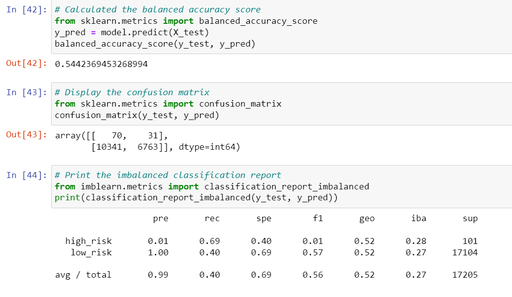
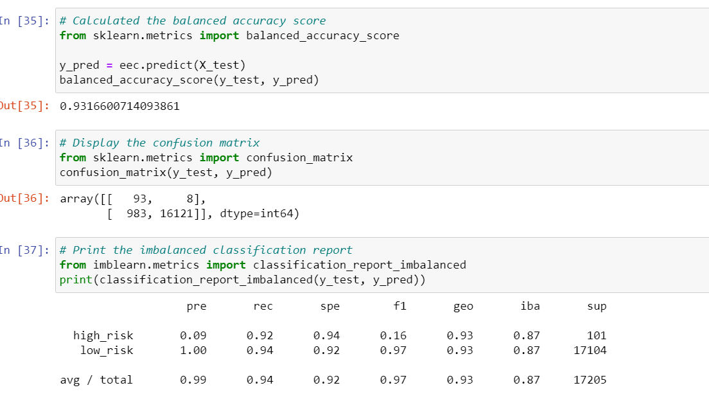

# Credit_Risk_Analysis

## Overview

  The purpose of this analysis was to analyze credit reports, through a process of trying differnt machine learning models to see which would produce the most accurate report.

## Results

  As will be depicted below, three out of the six machine learning modules had very similar accuracy resutls, with another performing a bit lower and yet another producing much more accurate results.  The lowest performing, Undersampling, and the highest performing, Easy Ensemble AdaBoost Classifier, machine models will be pictured below, followed by written results for all of the models.
  
  
  
  
  
  
  - Oversampling
    -   Accuracy of 65%
    -   Precision scores of 1% and 100%
    -   Recall scores of 71% and 58%

  - SMOTE
    - Accuracy of 66%
    - Precision scores of 1% and 100%
    - Recall scores of 63% and 68%

  - Undersampling
    - Accuracy of 54%
    - Precision scores of 1% and 100%
    - Recall scores of 69% and 40%

  - Combination
    - Accuracy of 67%
    - Precision scores of 1% and 100%
    - Recall scores of 73% and 60%

  - Balance Random Forest Classifier
    - Accuracy of 79%
    - Precision scores of 3% and 100%
    - Recall scores of 70% and 87%

  - Easy Ensemble AdaBoost Classifier
    - Accuracy of 93%
    - Precision scores of 9% and 100%
    - Recall scores of 92% and 94%

## Summary

  Four out of six models had identical precision scores of 1% and 100%, with the other two models having minimal differences, but the models did not have consistent recall scores.  While the precision scores did not vary greatly, one model brightly outshone the others when it came to accuracy.  Due to the significant icrease in accuracy and recall scores, I would recommend using the Easy Ensemble AdaBoost Classifier for future credit card analysis. 

